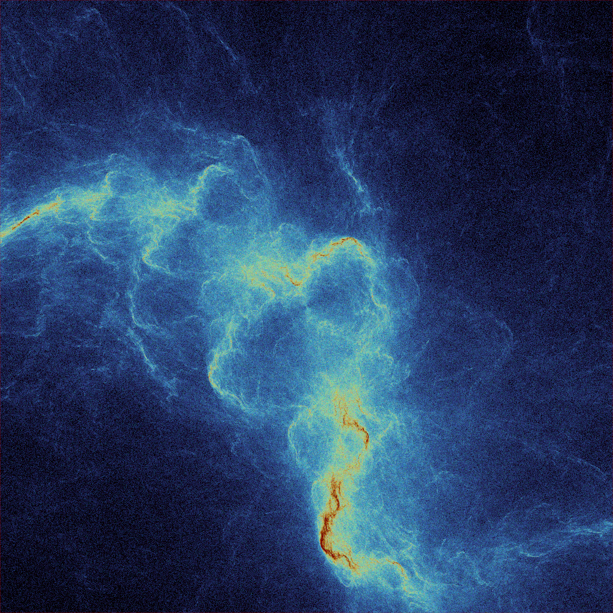

ChasoGame
=========

Implementation of the [Fractal flame algorithm](docs/flame.pdf).

Output
------
An example image:



An example output:
```
Render animation: 1800
Render image: output/frame0000.png
  Generated entropy in 243 milliseconds.
  Sampled points in 1247 milliseconds.
  Mapped points to pixels in 149 milliseconds.
  Colored pixels in 2 milliseconds.
  Write image to file in 42 milliseconds.
Rendered in 1 seconds (0/1800).
```
